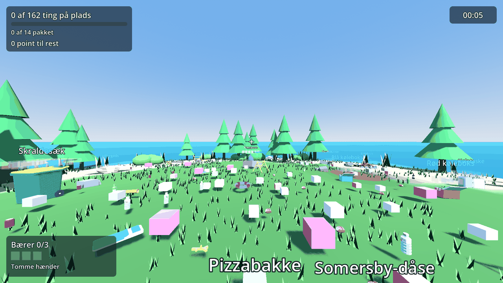
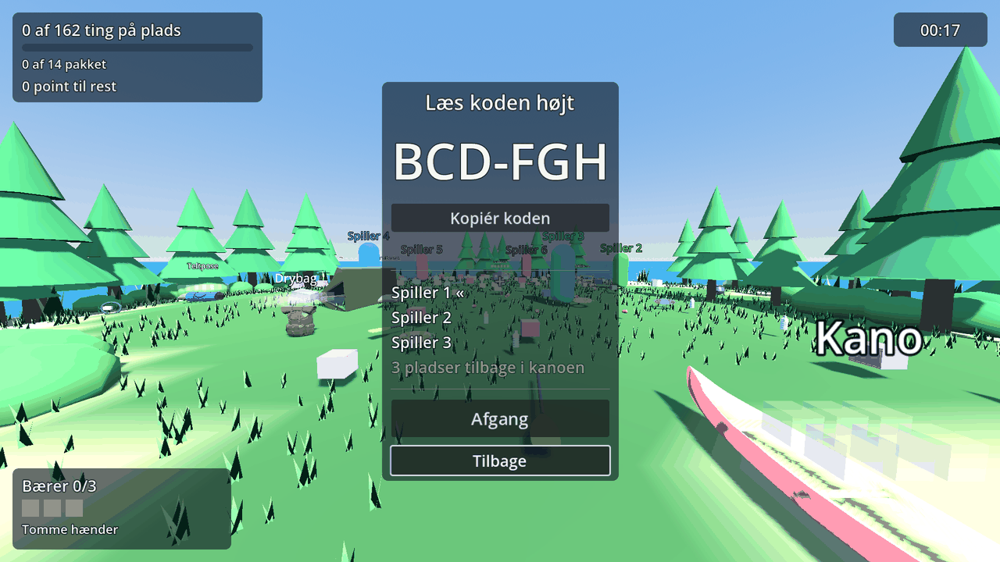
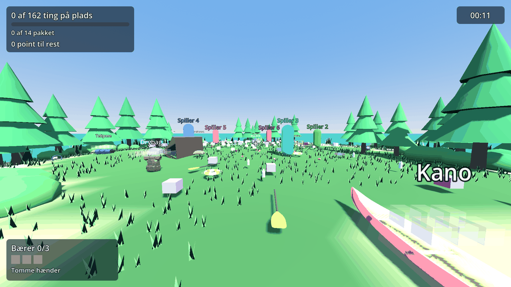
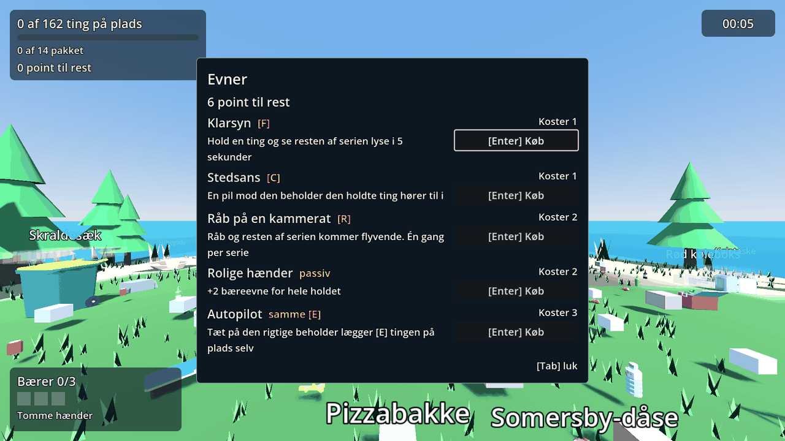
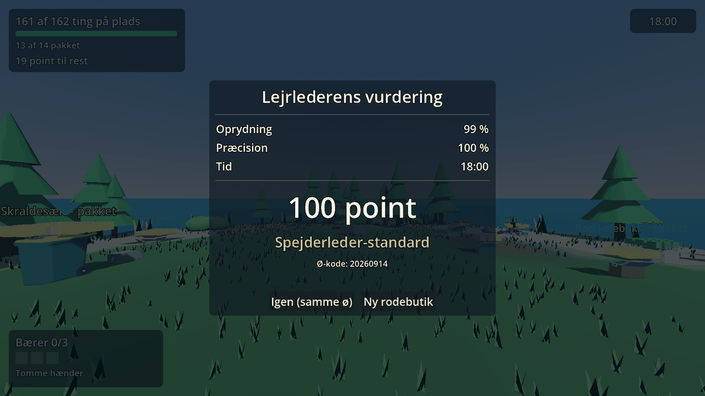

# Kanoølpik

> *Ryd øen op før I må padle videre.*
> A cooperative first-person tidy-up game: a group of mates wakes up on a small island in a Swedish lake after a night of partying. Every can, tent pole and sock has a place it belongs — and the canoes stay beached until the island is spotless.

Mechanically a love letter to *Librarian: Tidy Up the Arcane Library!* — items have a **category → series → sequence** home, correct placements chime, completed containers unlock abilities, and a hidden **camp leader's evaluation** grades speed and accuracy.

**Engine:** Godot 4.7 (GDScript) · **Target:** browser (static hosting, GitHub Pages) · **Multiplayer:** up to 6, host-authoritative over a WebSocket relay ([ADR 0011](docs/adr/0011-websocket-relay.md)) · **Language:** Danish UI, English in the same CSV.



## Playing with friends

One of you presses **Lav et hold** and reads the six characters aloud. Everybody else types them into the code field and presses **Join**. When the room is full enough, the host presses **Afgang** and you all land on the same island.

The code *is* the island: the same six characters always generate the same mess, so a room is reproducible and nothing about the level ever travels over the wire. The code stays under the clock for the whole round, so somebody arriving late can be told it — joining a round that is already running works, and a player who drops out gets the code back in the field with **Join** focused.

Six is the limit. The host leaving ends the round for everyone; anybody else leaving just drops their armful where they stood.





## Controls

| Key | What it does |
|---|---|
| **WASD** / **Shift** | Walk / sprint |
| **Mouse** | Look |
| **Space** | Jump |
| **E** | Pick up · put in the container you are aiming at · take back out of an occupied slot |
| **Q** | Drop the item you are holding |
| **Tab** | Skills — spend the party's points |
| **F** | **Klarsyn** — the rest of the series glows |
| **R** | **Råb på en kammerat** — the series flies to you |
| **C** | **Stedsans** — an arrow to the nearest home |
| **E** (aiming at nothing) | **Autopilot** — put the held item where it belongs |
| **Esc** | Pause — and release the mouse, which is the same key doing both |
| **F1** | Test panel, in a build with test mode on |

The four abilities have to be bought first. Points are **shared**: anybody in the room can spend them, which is deliberate and occasionally an argument.



## Quick start

```bash
# 1. Install Godot 4.7.x (standard build, not .NET) — https://godotengine.org/download
# 2. Import once, so translations and models exist
godot --headless --path . --import
# 3. Open it
godot --path . --editor
# 4. Press F5. You wake on the island with 162 things scattered over it.

# The whole test suite, headless — the same thing CI runs
GODOT_BIN=/path/to/godot bash tools/run_tests.sh

# Everything CI runs, including the relay's own suite and the size budget
GODOT_BIN=/path/to/godot bash tools/check.sh
```

The relay is a Cloudflare Worker in [`infra/relay/`](infra/relay/) with 18 tests of its own that run in real `workerd` in about two seconds (`npm ci && npm test`). It is deployed separately and knows nothing about the game — payloads pass through it unread.

## Read this first

| Doc | What it answers |
|---|---|
| [docs/VISION.md](docs/VISION.md) | What are we making, for whom, what does "done" feel like |
| [docs/GAME_DESIGN.md](docs/GAME_DESIGN.md) | Rules, scoring, abilities, the reference-game mapping |
| [docs/ARCHITECTURE.md](docs/ARCHITECTURE.md) | Layers, command flow, folder ownership (diagrams) |
| [docs/NETWORKING.md](docs/NETWORKING.md) | The relay protocol, room codes, what travels and what does not |
| [docs/ROADMAP.md](docs/ROADMAP.md) | Phases and isolated work packages, what can run in parallel |
| [docs/CONVENTIONS.md](docs/CONVENTIONS.md) | Code style, folder rules, scene rules, commit format |
| [docs/GAME_DEV_PRIMER.md](docs/GAME_DEV_PRIMER.md) | Game-dev concepts for experienced non-game developers |
| [docs/adr/](docs/adr/) | Why Godot, why static hosting, why a pure core, why a relay instead of WebRTC |
| [CLAUDE.md](CLAUDE.md) | Instructions for AI agents working in this repo — read it before touching anything |

## Repository layout

```
src/core/       Pure GDScript rules & state. No Nodes, no autoloads, no tr(). Deterministic and unit tested.
src/game/       Scenes & presentation, one folder per feature (player, island, items, containers, hud,
                abilities, lobby, settings, player/remote)
src/net/        The transport seam: LocalTransport alone, WebSocketTransport with friends
src/autoload/   GameEvents (signal bus) and GameSession (owns the running level)
infra/relay/    The Cloudflare Worker that passes messages between six browsers
data/           Content as JSON: item catalog, containers, levels — add content without touching code
assets/         Models, audio, i18n CSV
tests/          gdUnit4: unit/ mirrors src/core, integration/ runs real scenes, net/ runs real sockets
docs/           Everything above, plus one work-package file per task
tools/          run_tests.sh, check.sh, and shots.gd — which renders these screenshots headless
```

**The core is the thing to guard.** `src/core/` has no idea a network exists: every peer runs the same `CommandProcessor` over the same `WorldState`, and the host only decides *whether* a command happens and *in what order*. That is what makes six browsers agree, and it is why nothing in `src/core/` may reach for a Node, an autoload or a translation.

## Status

**Phases 0–4 are done. 651 Godot tests + 18 relay tests, green.**

Phase 4 closed on 2026-09-20: room codes, remote avatars, a HUD that names who did what, and reconnect. Phase 5 — settings, accessibility, the intro, and shipping it somewhere a person would click — is [written up as seven work packages](docs/roadmap/phase-5/).

What has *not* happened yet is a real playtest. Two people have played together, once; most of the multiplayer layer has never been seen by more than that. See [WP-5.7](docs/roadmap/phase-5/WP-5.7-what-the-crew-found.md).


