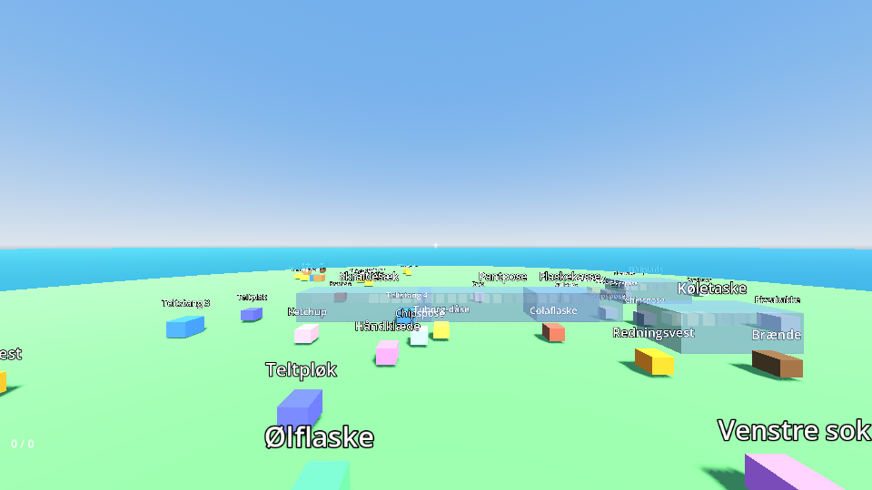

# Kanoølpik

> *Ryd øen op før I må padle videre.*
> A cooperative first-person tidy-up game: a group of mates wakes up on a small island in a Swedish lake after a night of partying. Every can, tent pole and sock has a place it belongs — and the canoes stay beached until the island is spotless.

Mechanically a love letter to *Librarian: Tidy Up the Arcane Library!* — items have a **category → series → sequence** home, correct placements chime, completed containers unlock abilities, and a hidden **camp leader's evaluation** grades speed and accuracy.

**Engine:** Godot 4.7 (GDScript) · **Target:** browser (static hosting, GitHub Pages) · **Multiplayer:** up to 6, host-authoritative over WebRTC (phase 4) · **Language:** Danish UI, English-ready.

## Quick start

```bash
# 1. Install Godot 4.7.x (standard build, not .NET) — https://godotengine.org/download
# 2. Open the project
godot --path . --editor
# 3. Press F5 — you spawn on a gray-box island full of junk. WASD, mouse, E = pick up / put in, Q = drop, Esc = release mouse.

# Run the whole test suite headless (also what CI runs)
GODOT_BIN=/path/to/godot bash tools/run_tests.sh
```

## Read this first

| Doc | What it answers |
|---|---|
| [docs/VISION.md](docs/VISION.md) | What are we making, for whom, what does "done" feel like |
| [docs/GAME_DESIGN.md](docs/GAME_DESIGN.md) | Rules, scoring, abilities, the reference-game mapping |
| [docs/ARCHITECTURE.md](docs/ARCHITECTURE.md) | Layers, command flow, folder ownership, multiplayer plan (diagrams) |
| [docs/ROADMAP.md](docs/ROADMAP.md) | Phases and isolated work packages, what can run in parallel |
| [docs/CONVENTIONS.md](docs/CONVENTIONS.md) | Code style, folder rules, scene rules, commit format |
| [docs/GAME_DEV_PRIMER.md](docs/GAME_DEV_PRIMER.md) | Game-dev concepts for experienced non-game developers |
| [docs/adr/](docs/adr/) | Why Godot, why static hosting, why a pure core, etc. |
| [CLAUDE.md](CLAUDE.md) | Instructions for AI agents working in this repo |

## Repository layout

```
src/core/       Pure GDScript rules & state. No Nodes. 100% unit tested. The multiplayer-safe heart.
src/game/       Scenes & presentation, one folder per feature (player, island, items, containers, hud, abilities)
src/net/        Transport seam: LocalTransport now, WebRtcTransport in phase 4
src/autoload/   GameEvents (signal bus) and GameSession (owns the running level)
data/           Content as JSON: item catalog, containers, levels — add content without touching code
assets/         Models, audio, i18n CSV
tests/          gdUnit4 suites: unit/ mirrors src/core, integration/ runs real scenes headless
docs/           Everything above
tools/          run_tests.sh and friends
```

## Status



Phase 0 (foundation) complete: bootable gray-box vertical slice, core rules engine with 74 passing tests, CI with headless tests + web export + Pages deploy. See [docs/ROADMAP.md](docs/ROADMAP.md) for what's next.
