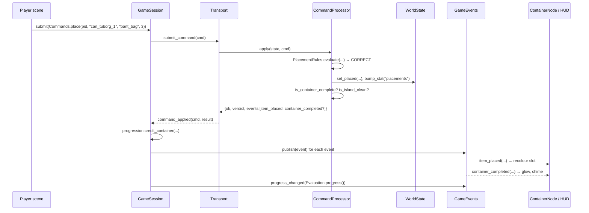
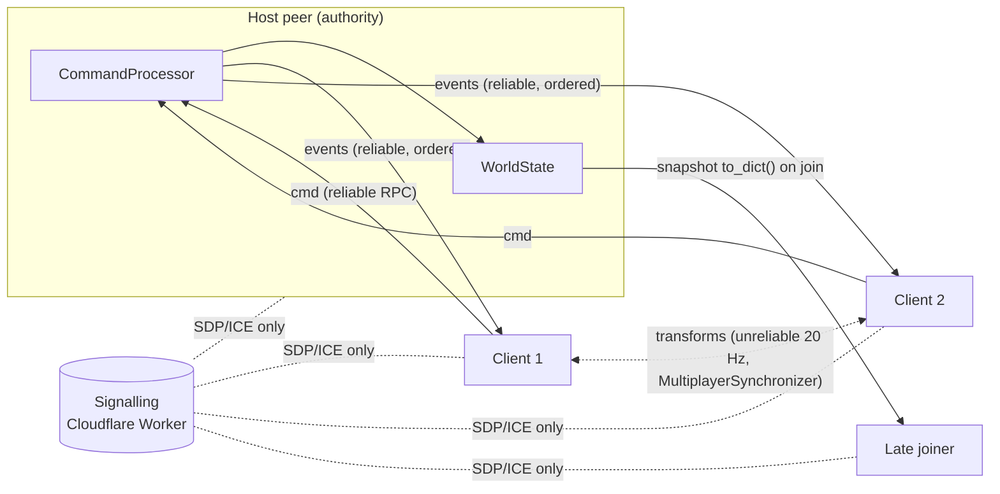

# Architecture

## 1. Layers

```mermaid
flowchart TB
    subgraph Presentation["src/game/*  — Scenes (Nodes). One folder per feature."]
        P[player/] ; I[island/] ; IT[items/] ; C[containers/] ; H[hud/] ; A[abilities/]
    end
    subgraph Autoload["src/autoload/ — glue"]
        GS[GameSession<br/>owns Catalog, WorldState,<br/>CommandProcessor, Progression, Transport]
        GE[GameEvents<br/>signal bus]
    end
    subgraph Net["src/net/ — transport seam"]
        T[Transport (interface)]
        LT[LocalTransport]
        WT[WebRtcTransport<br/>(phase 4)]
    end
    subgraph Core["src/core/ — pure GDScript, no Nodes, deterministic, 100% tested"]
        CAT[Catalog] ; ID[ItemDef] ; CD[ContainerDef]
        WS[WorldState] ; PR[PlacementRules] ; CP[CommandProcessor] ; CM[Commands]
        EV[Evaluation] ; MG[MessGenerator] ; PG[Progression]
    end
    subgraph Data["data/*.json — content"]
        DI[items.json] ; DC[containers.json] ; DL[levels/*.json]
    end

    Presentation -- "submit(cmd)" --> GS
    GS --> T
    T --> LT & WT
    LT -- "apply(state, cmd)" --> CP
    CP --> PR & WS
    GS -- "publish(events)" --> GE
    GE -. signals .-> Presentation
    Presentation -. "read-only" .-> WS & CAT
    CAT --> DI & DC
    MG --> DL
```

Dependency direction is strictly downward: **core knows nothing about anything above it.** Presentation never imports another presentation feature; they only meet on the `GameEvents` bus.

## 2. One interaction, end to end



In multiplayer the only change is inside `T`: `WebRtcTransport` sends the command to the host, the host runs `CP.apply`, and broadcasts the result. Nothing above or below the seam changes.

## 3. Core domain model

```mermaid
classDiagram
    class ItemDef { id; category; series; sequence; size; name_key; model }
    class ContainerDef { id; accepts[]; slot_count; ordered; name_key; scene }
    class Catalog { get_item(); get_container(); series_members(); containers_accepting(); validate() }
    class WorldState { locations: item→(GROUND pos | CARRIED player | PLACED container,slot); players; stats; elapsed_ticks; to_dict(); from_dict() }
    class PlacementRules { <<static>> evaluate() Verdict; is_container_complete(); is_island_clean(); find_correct_slot() }
    class Commands { <<static>> pick_up(); drop(); place(); take_out(); tick() }
    class CommandProcessor { apply(state, cmd) → {ok, error, verdict, events[]} }
    class Evaluation { <<static>> progress(); score(); grade_for() }
    class MessGenerator { <<static>> generate(seed, catalog, zones) WorldState }
    class Progression { points; unlocked[]; credit_container(); unlock() }
    Catalog o-- ItemDef
    Catalog o-- ContainerDef
    CommandProcessor --> Catalog
    CommandProcessor --> PlacementRules
    CommandProcessor --> WorldState
    PlacementRules --> Catalog
    PlacementRules --> WorldState
    Evaluation --> PlacementRules
    MessGenerator --> Catalog
```

Why commands as Dictionaries and not classes: they serialise to JSON/RPC for free, they log and replay trivially, and peers need no class registration.

Why `WorldState` is dumb: all invariants live in one place (`CommandProcessor` + `PlacementRules`), so a state snapshot is always valid by construction and can be restored on any peer.

## 4. Folder ownership (the parallel-agent contract)

| Folder | Owner | Who else may touch it |
|---|---|---|
| `src/core/` | Core WPs only | Nobody else; add a WP if you need a new rule |
| `src/game/<feature>/` | The WP that names it | Nobody else in the same phase |
| `src/autoload/` | Foundation / infra WPs | Read-only for feature WPs |
| `src/net/` | Networking WPs (phase 4) | Read-only |
| `data/` | Content WPs | Any WP may *add* rows; never rename ids |
| `assets/i18n/strings.csv` | Shared | Append-only; keys namespaced by feature (`ui.hud.*`, `ability.*`) |
| `assets/models/`, `assets/audio/` | Art/audio WPs | Feature WPs may add files under their own subfolder |
| `tests/` | Mirrors the above | Add tests for what you own |
| `project.godot`, `export_presets.cfg` | Infra WPs | Ask first (input map additions go in the WP text) |

Merge-conflict avoidance rules:
- Scenes are thin. Compose in `_ready()` from data (see `island.gd`) rather than hand-placing hundreds of nodes in a `.tscn`.
- One scene per feature; features connect only via `GameEvents` signals and `GameSession` reads.
- New signals go on `GameEvents` in an infra PR *before* the feature PRs that need them, so features never edit the bus concurrently.

## 5. Determinism and multiplayer readiness

Everything in `src/core/` must be a pure function of its inputs:
- Iterate sorted ids (`catalog.item_ids()`, `state.item_ids()`), never raw `Dictionary` order.
- Randomness only through a seeded `RandomNumberGenerator` passed in (see `MessGenerator`).
- Time only through `Commands.tick`, never `Time.get_ticks_msec()`.
- No floats in decisions that peers must agree on (slot indices and ids decide; positions are presentation).

`test_same_commands_produce_identical_states` is the canary for this.

### Phase 4 network model



Static hosting forbids a game server, so the host is a player. WebRTC works in browsers; Godot's `WebRTCMultiplayerPeer` plugs into the high-level multiplayer API. The signalling service only brokers connections (a few KB per session) and can be any free serverless endpoint.

## 6. Web export constraints

- Renderer: **GL Compatibility** (Forward+ is not available on web).
- **Threads disabled** in the Web preset → no `SharedArrayBuffer` → no COOP/COEP headers needed → GitHub Pages just works. Cost: audio latency slightly higher, no `Thread`/`WorkerThreadPool` in gameplay code.
- Physics: Jolt (built in since 4.4). Fine on web.
- Keep the initial download small: no textures over 1024², compressed audio, low-poly models. Target < 40 MB total.

## 7. Testing strategy

| Layer | Tool | Where | What |
|---|---|---|---|
| Core rules | gdUnit4 unit tests | `tests/unit/core/` | Every branch of every rule; determinism; serialisation round-trips |
| Content | gdUnit4 data tests | `test_data_integrity.gd` | Catalog validates, level positions/zones cover everything, i18n keys exist, containers have room |
| Scene wiring | gdUnit4 integration | `tests/integration/` | Real scenes headless: spawn counts, event → presentation reactions |
| Boot | CLI | CI `--quit-after` | Project starts without script errors |
| Feel | Human | Playtest checklist in each WP | Things a test can't judge |

Run everything with `tools/run_tests.sh`. CI runs it on every PR, then exports web and deploys `main` to Pages.
