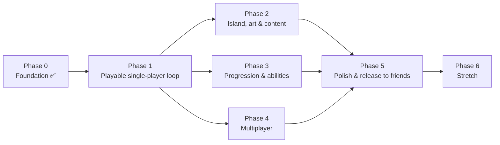

# Roadmap

Work is cut into **phases** (a playable milestone each) and **work packages** (WPs: one agent, one branch, one PR, hours to a couple of days). Each WP file in `docs/roadmap/phase-N/` states goal, owned folders, interfaces, acceptance criteria and a playtest checklist. Within a phase, WPs in the same *lane* are independent and can run in parallel; arrows are hard dependencies.

Phases 2, 3 and 4 are deliberately independent so three streams can run at once after phase 1.

## Phase 0 — Foundation ✅ (this repo)

Bootable gray-box vertical slice; pure core with 74 tests; data-driven content; i18n; CI (tests → web export → Pages); docs, ADRs, agent guide.

**Remaining human steps:** push to GitHub, enable Pages (Settings → Pages → Source: GitHub Actions), open the project in Godot 4.7 once and press F5, walk to a can, press E, walk to the pant bag, press E.

## Phase 1 — Playable single-player loop

*Exit criterion: a friend can play Island 01 start to finish in a browser, see their grade, and want to try again.*

**Status: everything except WP-1.7 (controller feel) is done — 190 tests.** The loop is complete end to end: title → play → evaluation → restart, with autosave and resume.

| WP | Title | Lane | Owns | Depends on |
|---|---|---|---|---|
| [1.1](roadmap/phase-1/WP-1.1-carry-visuals.md) ✅ | Carried items visible in hand | items | `src/game/items/` | — |
| [1.2](roadmap/phase-1/WP-1.2-placement-feedback.md) ✅ | Placement feedback: flash, chime, completion glow | containers+audio | `src/game/containers/`, `assets/audio/sfx/` | — |
| [1.3](roadmap/phase-1/WP-1.3-take-out-and-slot-targeting.md) ✅ | Take items back out; aim at a specific slot | containers/player | `src/game/containers/`, `src/game/player/` | 1.2 |
| [1.4](roadmap/phase-1/WP-1.4-hud-v1.md) ✅ | HUD v1 (Danish): progress, carrying, prompts, toasts | hud | `src/game/hud/` | — |
| [1.5](roadmap/phase-1/WP-1.5-evaluation-screen.md) ✅ | End-of-level evaluation screen + restart | hud/flow | `src/game/hud/evaluation/`, `src/game/main/` | 1.4 |
| [1.6](roadmap/phase-1/WP-1.6-title-and-flow.md) ✅ | Title screen, seed entry, pause, restart | flow | `src/game/main/`, `src/game/title/` | — |
| [1.7](roadmap/phase-1/WP-1.7-controller-feel.md) | Controller feel: acceleration, head bob toggle, FOV, sensitivity | player | `src/game/player/` | — |
| [1.8](roadmap/phase-1/WP-1.8-save-load.md) ✅ | Save/load via WorldState snapshot (core + autoload) | core/infra | `src/core/save_game.gd`, `src/autoload/` | — |

Parallel-safe sets: {1.1, 1.2, 1.4, 1.6, 1.7, 1.8} can all start at once. 1.3 after 1.2; 1.5 after 1.4.

## Phase 2 — Island, art & content

*Exit criterion: the island looks like a place; 150+ items; it still loads in < 10 s on a normal connection.*

**Wave 1 done (2.1, 2.4, 2.6), built in parallel by three agents in isolated worktrees. Wave 2: 2.5, 2.2 and 2.3 done — 262 tests, 162 items, 14 containers.** Assets are generated in code (ADR 0008) except hand-sourced `.glb` models (ADR 0009), which `ItemVisual` loads, auto-fits and falls back from. Remaining: dressing (2.7) and the performance pass (2.8); the model kit itself fills up one file at a time.

| WP | Title | Owns |
|---|---|---|
| [2.1](roadmap/phase-2/WP-2.1-terrain.md) ✅ | Procedural island terrain replacing the gray-box cylinder | `src/game/island/` |
| [2.2](roadmap/phase-2/WP-2.2-item-models.md) ✅ | Item model kit: loader + hand-sourced `.glb` models via `ItemDef.model`; fallback box stays | `assets/models/items/`, `src/game/items/` |
| [2.3](roadmap/phase-2/WP-2.3-container-models.md) ✅ | Container models: 13 of 14 in, fitted by real-world height, slots as a tray above them | `assets/models/containers/`, `src/game/containers/` |
| [2.4](roadmap/phase-2/WP-2.4-content.md) ✅ | Content: 162 items, 14 containers, two canoes with crews, sleeping bags ordered, unopened beer in two coolers | `data/`, `assets/i18n/` |
| [2.5](roadmap/phase-2/WP-2.5-environment.md) ✅ | Environment: trees, grass, reeds, bigger water (sky/water shaders and wind still open) | `src/game/island/environment/` |
| [2.6](roadmap/phase-2/WP-2.6-audio.md) ✅ | Audio: ambient lake, birds, music layers that rise with completion | `src/game/audio/`, `assets/audio/` |
| 2.7 | Mess dressing: non-interactive props (dead bonfire, collapsed tent, a snoring mate) | `src/game/island/dressing/` |
| 2.8 | Web performance pass: texture budgets, LOD, load-time measurement in CI | `tools/`, `export_presets.cfg` |

Wave 2 dependencies: 2.3 uses the loader from 2.2, so 2.2 goes first. 2.5 and 2.7 both place things on the terrain via `Island.height_at()` and can run alongside. 2.8 goes last, once there is something to measure.

**Models are sourced by hand** (ADR 0009): `.glb` only, CC0 or CC-BY only, and every file needs a row in `assets/models/CREDITS.md` before it ships. Roughly 25 models cover all 150 items — one per kind of object, tinted and auto-fitted per item.

## Phase 3 — Progression & abilities

*Exit criterion: completing containers feels rewarding; every ability is usable and tested.*

| WP | Title | Owns |
|---|---|---|
| 3.1 | Skill point UI + unlock menu (Tab) | `src/game/hud/skills/` |
| 3.2 | Klarsyn (Insight): series siblings glow | `src/game/abilities/insight/` |
| 3.3 | Stedsans (Map sense): HUD arrow | `src/game/abilities/map_sense/` |
| 3.4 | Råb på en kammerat (Call a mate): items fly to you — needs a core `summon` command | `src/core/` (new command), `src/game/abilities/call_mate/` |
| 3.5 | Rolige hænder: capacity bonus applied live | `src/autoload/` (capacity refresh), tests |
| 3.6 | Autopilot: proximity auto-place | `src/game/abilities/auto_place/` |
| 3.7 | Hidden collectibles (4 per island) | `data/`, `src/game/collectibles/` |
| 3.8 | Evaluation tuning: par times from playtests, grade copy | `data/levels/`, `assets/i18n/` |

3.1 first (others plug into it); 3.4 needs a core change → do it first in the core lane.

## Phase 4 — Multiplayer (≤ 6, host-authoritative WebRTC)

*Exit criterion: six browsers on different networks finish Island 01 together via a room code.*

| WP | Title | Owns |
|---|---|---|
| 4.1 | Signalling service (Cloudflare Worker) + protocol doc | `infra/signalling/`, `docs/NETWORKING.md` |
| 4.2 | `WebRtcTransport`: command relay, event broadcast, snapshot on join, ordering guarantees | `src/net/` |
| 4.3 | Simulated multi-peer test harness (N processors, one authority, in-process) | `tests/net/`, `src/net/sim_transport.gd` |
| 4.4 | Lobby: create/join by room code, player list, ready-up, seed sync | `src/game/lobby/` |
| 4.5 | Remote player avatars: `MultiplayerSynchronizer` transforms, name tags, held items | `src/game/player/remote/` |
| 4.6 | Join/leave/reconnect, host-left handling, dropped items on disconnect | `src/net/`, `src/autoload/` |
| 4.7 | Multiplayer HUD: who placed what, shared toasts, ping | `src/game/hud/` |

Order: 4.3 (harness) and 4.1 first and in parallel; 4.2 uses 4.3; 4.4/4.5/4.7 after 4.2.

## Phase 5 — Polish & release to friends

Settings (sensitivity, FOV, language toggle, audio), accessibility (colour-blind-safe verdict colours, subtitles for cues), hangover-blur intro shader, itch.io mirror, PWA icon, README screenshots, first playtest with the actual canoe crew and a bug-fix week.

## Phase 6 — Stretch

Second island (different lake, night arrival), weather events (rain scatters items again), host migration, speedrun timer + local leaderboard, gamepad support, mobile touch layout.

## How WPs get written

Copy `docs/roadmap/WP-TEMPLATE.md`. Keep it under a page. If a WP would touch more than two owned folders, split it.
