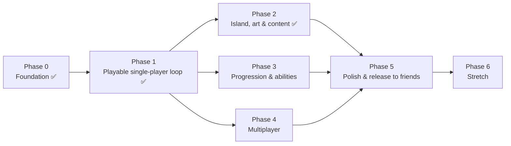

# Roadmap

Work is cut into **phases** (a playable milestone each) and **work packages** (WPs: one agent, one branch, one PR, hours to a couple of days). Each WP file in `docs/roadmap/phase-N/` states goal, owned folders, interfaces, acceptance criteria and a playtest checklist. Within a phase, WPs in the same *lane* are independent and can run in parallel; arrows are hard dependencies.

Phases 2, 3 and 4 are deliberately independent so three streams can run at once after phase 1.

## Phase 0 — Foundation ✅ (this repo)

Bootable gray-box vertical slice; pure core with 74 tests; data-driven content; i18n; CI (tests → web export → Pages); docs, ADRs, agent guide.

**Remaining human steps:** push to GitHub, enable Pages (Settings → Pages → Source: GitHub Actions), open the project in Godot 4.7 once and press F5, walk to a can, press E, walk to the pant bag, press E.

## Phase 1 — Playable single-player loop

*Exit criterion: a friend can play Island 01 start to finish in a browser, see their grade, and want to try again.*

**Status: everything except WP-1.7 (controller feel) is done — 190 tests.** The loop is complete end to end: title → play → evaluation → restart, with autosave and resume.

| WP | Title | Lane | Owns | Depends on |
|---|---|---|---|---|
| [1.1](roadmap/phase-1/WP-1.1-carry-visuals.md) ✅ | Carried items visible in hand | items | `src/game/items/` | — |
| [1.2](roadmap/phase-1/WP-1.2-placement-feedback.md) ✅ | Placement feedback: flash, chime, completion glow | containers+audio | `src/game/containers/`, `assets/audio/sfx/` | — |
| [1.3](roadmap/phase-1/WP-1.3-take-out-and-slot-targeting.md) ✅ | Take items back out; aim at a specific slot | containers/player | `src/game/containers/`, `src/game/player/` | 1.2 |
| [1.4](roadmap/phase-1/WP-1.4-hud-v1.md) ✅ | HUD v1 (Danish): progress, carrying, prompts, toasts | hud | `src/game/hud/` | — |
| [1.5](roadmap/phase-1/WP-1.5-evaluation-screen.md) ✅ | End-of-level evaluation screen + restart | hud/flow | `src/game/hud/evaluation/`, `src/game/main/` | 1.4 |
| [1.6](roadmap/phase-1/WP-1.6-title-and-flow.md) ✅ | Title screen, seed entry, pause, restart | flow | `src/game/main/`, `src/game/title/` | — |
| [1.7](roadmap/phase-1/WP-1.7-controller-feel.md) | Controller feel: acceleration, head bob toggle, FOV, sensitivity | player | `src/game/player/` | — |
| [1.8](roadmap/phase-1/WP-1.8-save-load.md) ✅ | Save/load via WorldState snapshot (core + autoload) | core/infra | `src/core/save_game.gd`, `src/autoload/` | — |

Parallel-safe sets: {1.1, 1.2, 1.4, 1.6, 1.7, 1.8} can all start at once. 1.3 after 1.2; 1.5 after 1.4.

## Phase 2 — Island, art & content

*Exit criterion: the island looks like a place; 150+ items; it still loads in < 10 s on a normal connection.*

**Phase 2 is complete — 279 tests, 162 items, 14 containers, 12.5 MB gzipped download.** Every container and most item categories have real models (ADR 0009); trash, food, cookware, clothing and misc are still generated boxes and the game is fully playable that way. Assets that are not models are generated in code (ADR 0008).

Exit criterion — "the island looks like a place; 150+ items; loads in < 10 s on a normal connection" — is met on home broadband (~4 s) and not on mobile data (~21 s), three quarters of it the Godot engine wasm. The one thing phase 2 could not check from CI is frame rate on real hardware; see WP-2.8.

| WP | Title | Owns |
|---|---|---|
| [2.1](roadmap/phase-2/WP-2.1-terrain.md) ✅ | Procedural island terrain replacing the gray-box cylinder | `src/game/island/` |
| [2.2](roadmap/phase-2/WP-2.2-item-models.md) ✅ | Item model kit: loader + hand-sourced `.glb` models via `ItemDef.model`; fallback box stays | `assets/models/items/`, `src/game/items/` |
| [2.3](roadmap/phase-2/WP-2.3-container-models.md) ✅ | Container models: 13 of 14 in, fitted by real-world height, slots as a tray above them | `assets/models/containers/`, `src/game/containers/` |
| [2.4](roadmap/phase-2/WP-2.4-content.md) ✅ | Content: 162 items, 14 containers, two canoes with crews, sleeping bags ordered, unopened beer in two coolers | `data/`, `assets/i18n/` |
| [2.5](roadmap/phase-2/WP-2.5-environment.md) ✅ | Environment: trees, grass, reeds, bigger water (sky/water shaders and wind still open) | `src/game/island/environment/` |
| [2.6](roadmap/phase-2/WP-2.6-audio.md) ✅ | Audio: ambient lake, birds, music layers that rise with completion | `src/game/audio/`, `assets/audio/` |
| [2.7](roadmap/phase-2/WP-2.7-mess-dressing.md) ✅ | Mess dressing: collapsed tent, a mate still asleep and snoring, trampled ground — no colliders | `src/game/island/dressing/` |
| [2.8](roadmap/phase-2/WP-2.8-web-performance.md) ✅ | Web performance: download measured and budgeted in CI (12.5 MB gzipped), scene-shape budgets | `tools/`, `tests/` |

**Models are sourced by hand** (ADR 0009): `.glb` only, CC0 or CC-BY only, and every file needs a row in `assets/models/CREDITS.md` before it ships. One model serves a whole category, rotated differently per item. Five categories are still boxes: `trash`, `food`, `cookware`, `clothing`, `misc` — filling them in is a data change, not a code change.

**Sizes are stated in metres, not derived from gameplay numbers.** `ItemPalette.CATEGORY_LENGTHS` for items, `ContainerDef.model_height` for containers. Deriving metres from carry slots made a paddle 34 cm long and a bin bag 5.3 m tall.

## Phase 3 — Progression & abilities

*Exit criterion: completing containers feels rewarding; every ability is usable and tested.*

WP files: [`docs/roadmap/phase-3/`](roadmap/phase-3/). **WP-3.0 blocks everything else** — it implements [ADR 0010](adr/0010-progression-is-replicated-state.md), which moves progression inside the replicated state so abilities that touch the world go through commands.

| WP | Title | Lane | Owns | Depends on |
|---|---|---|---|---|
| [3.0](roadmap/phase-3/WP-3.0-progression-core.md) | Progression as replicated state; `unlock` + `summon` commands; all phase-3 input actions | core/infra | `src/core/`, `src/autoload/`, `project.godot` | — |
| [3.1](roadmap/phase-3/WP-3.1-skill-menu.md) | Skill point UI + unlock menu (Tab); provides `Hud.ability_layer()` | hud | `src/game/hud/skills/`, `hud.gd` | 3.0 |
| [3.2](roadmap/phase-3/WP-3.2-insight.md) | Klarsyn: series siblings glow | abilities | `src/game/abilities/insight/` | 3.0 |
| [3.3](roadmap/phase-3/WP-3.3-map-sense.md) | Stedsans: HUD arrow | abilities | `src/game/abilities/map_sense/` | 3.0, 3.1 |
| [3.4](roadmap/phase-3/WP-3.4-call-a-mate.md) | Råb på en kammerat: the series flies to you | abilities | `src/game/abilities/call_mate/` | 3.0 |
| [3.6](roadmap/phase-3/WP-3.6-auto-place.md) | Autopilot: proximity auto-place | abilities/player | `src/game/abilities/auto_place/`, `player.gd` | 3.0 |
| [3.7](roadmap/phase-3/WP-3.7-collectibles.md) | Hidden collectibles (4 per island) | content | `src/game/collectibles/`, `data/` | 3.0 |
| [3.8](roadmap/phase-3/WP-3.8-evaluation-tuning.md) | Evaluation tuning from measured runs | content | `data/levels/`, `assets/i18n/` | 3.1–3.7 + playtest |
| [3.9](roadmap/phase-3/WP-3.9-hvalen-design-questions.md) | "Hvalen" — open design questions | design | — | a decision session |
| [3.10](roadmap/phase-3/WP-3.10-test-mode.md) ✅ | Test mode: admin panel (F1), win-condition tool | tooling | `src/dev/` | 3.0 |

**WP-3.5 (Rolige hænder) is gone as a separate package.** Capacity is `WorldState`, so the unlock effect belongs in 3.0; showing it belongs in 3.1. A WP that owns neither its data nor its display is a coordination cost with nothing in it.

**WP-3.10 (test mode) is done and serves every remaining WP**: F1 opens a panel that packs the island bar one item, hands out points, buys abilities, jumps the clock and teleports. Use it rather than playing a full round to reach the thing under test — and note that the win condition is now asserted in CI because of it.

**Waves.** 3.0 alone first. Then {3.1, 3.2, 3.4} in parallel — disjoint folders, no shared files. Then {3.3, 3.6, 3.7}. 3.8 after a human plays; 3.9 after a design session.

**Scheduling constraint:** WP-3.6 and the parked [WP-1.7](roadmap/phase-1/WP-1.7-controller-feel.md) both own `src/game/player/player.gd`. Run one or the other, never both — the phase-2 lesson was that agent conflicts are semantic, and two agents rewriting the same interact path is the textual kind on top.

## Phase 4 — Multiplayer (≤ 6, host-authoritative)

*Exit criterion: six browsers on different networks finish Island 01 together via a room code.*

WP files: [`docs/roadmap/phase-4/`](roadmap/phase-4/). **[ADR 0011](adr/0011-websocket-relay.md) replaces WebRTC with a WebSocket relay** — same GitHub Pages hosting, same host-authoritative design, but the real transport can be exercised in CI and on a desktop, and no friend is excluded by their NAT. Stock Godot cannot create a WebRTC peer at all (`No default WebRTC extension configured`), which is what settled it.

| WP | Title | Lane | Owns | Depends on |
|---|---|---|---|---|
| [4.3](roadmap/phase-4/WP-4.3-sim-harness.md) ✅ | Simulated multi-peer harness (N peers, one authority, in-process) | net/test | `src/net/sim_transport.gd`, `tests/net/` | — |
| [4.1](roadmap/phase-4/WP-4.1-relay.md) ✅ | The relay: Cloudflare Worker, room codes, protocol doc | infra | `infra/relay/`, `docs/NETWORKING.md` | — |
| [4.2](roadmap/phase-4/WP-4.2-websocket-transport.md) ✅ | `WebSocketTransport`: commands up, events down, snapshot on join | net | `src/net/websocket_transport.gd` | 4.3, 4.1 |
| [4.4](roadmap/phase-4/WP-4.4-lobby.md) ✅ | Lobby: create/join by room code, player list, the island the code names | flow/hud | `src/game/lobby/` | 4.2 |
| [4.5](roadmap/phase-4/WP-4.5-remote-avatars.md) | Remote avatars, name tags, held items | player | `src/game/player/remote/` | 4.2 |
| [4.6](roadmap/phase-4/WP-4.6-join-leave-reconnect.md) | Join/leave/reconnect, host-left, dropped items | net | `src/net/`, `src/autoload/` | 4.2, 4.4 |
| [4.7](roadmap/phase-4/WP-4.7-multiplayer-hud.md) | Who did what, shared toasts, ping | hud | `src/game/hud/` | 4.2, 4.5 |

**Status: 4.3, 4.1 and 4.2 are done, and the relay is deployed** at `wss://kanoolpik-relay.kennet-hoejmark.workers.dev`. `.github/workflows/net-live.yml` runs `tests/net/` against it — the only check that can catch `FakeRelay` drifting from the Worker.

**The relay URL is baked into the build** and stated once, in `RelayEndpoint.HOST`. `net-live` greps that line; the repository variable `KANOOLPIK_RELAY_URL` is gone and should be deleted from the repository settings.

**WP-4.4 decided the seed is the room code.** Nothing about the island travels, and the same code is always the same island. It also stopped where it should: everyone is in the room and on the same terrain, but **peers are not yet players in the replicated state**, so nobody but the host can pick anything up until WP-4.6 adds an `add_player` command. That is the next thing to build.

**Waves.** {4.3, 4.1} in parallel — neither needs the other and neither touches `src/game/`. Then 4.2 alone, with the harness as its oracle. Then 4.4. **4.6 is now the one that matters**: until it lands, a multiplayer round is six people standing on the same island unable to touch anything. {4.5, 4.7} can run beside it.

**The seam already exists.** `src/net/transport.gd` was written in phase 0 for this, and `LocalTransport` is the proof it works: gameplay submits commands and listens for events, and has no idea whether a network is involved. Phase 4 adds a second implementation; `src/core/` and `src/game/` should barely change.

**Free has a shape.** ADR 0011 does the arithmetic: player transforms are the only traffic that matters, and the rate decides whether the free plan covers an evening's play. WP-4.5 owns that constant.

## Phase 5 — Polish & release to friends

Settings (sensitivity, FOV, language toggle, audio), accessibility (colour-blind-safe verdict colours, subtitles for cues), hangover-blur intro shader, itch.io mirror, PWA icon, README screenshots, first playtest with the actual canoe crew and a bug-fix week.

## Phase 6 — Stretch

Second island (different lake, night arrival), weather events (rain scatters items again), host migration, speedrun timer + local leaderboard, gamepad support, mobile touch layout.

## How WPs get written

Copy `docs/roadmap/WP-TEMPLATE.md`. Keep it under a page. If a WP would touch more than two owned folders, split it.
